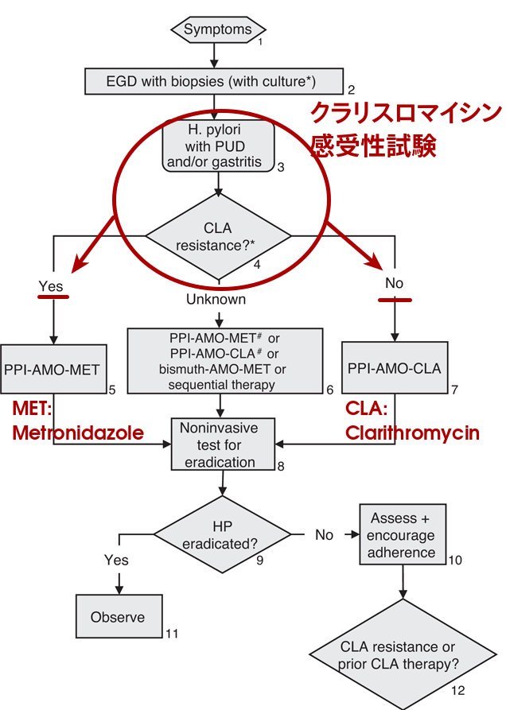

## Side effects and safety of Metronidazole 
パネルディスカッション$-$「若年者除菌と胃がん予防」

#### Chaochen Wang$^1$, Yingsong Lin$^1$, Masumi Okuda$^2$, Shogo Kikuchi$^1$

1. Department Public Health, Aichi Medical University School of Medicine
2. Department of General Medicine and Community Health Science, Hyogo College of Medicine

---
## Background

> - **Metronidazole (MNZ)** has been broadly prescribed as therapy for $H. pylori$ eradication. 
> - Proton pump inhibitor(PPI) $+$ Amoxicillin(AMPC) $+$ Clarithromycin (CLA) $=$ **(PAC)** regimen had a significant lower **eradication rate** of $60.5\%$ compared with PPI $+$ AMC $+$ MNZ $=$ **PAM** regimen $(98.3\%)$ [unpublished data, Mabe _et al._] 
> - Resistance rate of CLA in Japanese children is reported to be more than $40\%$. [[Kato and Fujimura 2010](http://onlinelibrary.wiley.com/doi/10.1111/j.1442-200X.2009.02915.x/abstract)]

--- 
## Carcinogenicity

> MNZ was categorized as **Possibly carcinogenic to human (2B)** 

> <cite>[by International Agency for Research on Cancer, 1987](http://monographs.iarc.fr/ENG/Monographs/suppl7/index.php)</cite>

--- 
## Pubmed searching 

> - Related literature (published until April. 2016) were reviewed. 

> - Search term:  
(("Drug-Related Side Effects and Adverse Reactions"[Mesh]) AND "Metronidazole"[Mesh])   OR   ( "Metronidazole/adverse effects"[Mesh] OR "Metronidazole/toxicity"[Mesh] )   OR    (("Metronidazole"[Mesh]) AND "Carcinogenicity Tests"[Mesh])

---

## Carcinogenic Evidences/Genetic damage/Impaired fertility

> - Oral exposure of MNZ has shown carcinogenic activity in mice and rats. 
    + **Pulmonary** tumorigenesis [[Rustia and Shubik 1972](http://www.ncbi.nlm.nih.gov/pubmed/5058971), [IARC 1977](http://www.inchem.org/documents/iarc/vol13/metronidazole.html), [Cavaliere _et al._ 1983](http://www.ncbi.nlm.nih.gov/pubmed/?term=Cavaliere+1983%2C+metronidazole)]
    + Malignant **liver cancer** [[Rustia and Shubik 1979](http://www.ncbi.nlm.nih.gov/pubmed/288941)]
    + Malignant **lymphomas** [[Rustia and Shubik 1972](http://www.ncbi.nlm.nih.gov/pubmed/5058971)]
    + **Mammary-gland** tumor [[Rustia and Shubik 1979](http://www.ncbi.nlm.nih.gov/pubmed/288941), [Cavaliere _et al._ 1984](http://www.ncbi.nlm.nih.gov/pubmed/?term=Cavaliere+1984%2C+metronidazole)]
    + **Pituitary-gland** tumor [[Rustia and Shubik 1979](http://www.ncbi.nlm.nih.gov/pubmed/288941)]
> - At very **high dose levels** (approx. 500 mg/kg/day $\approx$ 33 times the human doses), or with lifetime feeding ofMNZ. Which is unlikely in human usage.

> - Studies in mammals (_in vivo_) revealed no potential to genetic damage.

> - Fertility studies (in mice) at doses up to 6 times the maximum human dose have reported no evidence of impaired fertility.

---

# However,   not in humans

--- 
[Beard CM, _et al._ Lack of evidence for cancer due to use of metronidazole. N Engl J Med. 1979;301:519–522.](http://www.nejm.org/doi/full/10.1056/NEJM197909063011003)

--- 
## Other cancer studies in Humans

> - Data on MNZ carcinotenecity for humans is still not sufficient. 

> - No higher cancer risk in 12,000 users of MNZ. [[Danielson 1982](http://jama.jamanetwork.com/article.aspx?articleid=372448)] $\Longrightarrow$ Only followed for 2.5 years. (A letter to JAMA)

> - 5,222 MNZ user/nonuser pairs followed for 12.6 years found no association **(RR 0.98; 95% CI, 0.80$-$1.20)** between short-term exposure toMNZ and cancer in human.[[Falagas _et al._ 1998](http://cid.oxfordjournals.org/content/26/2/384.short)]

> - Another retrospective study of children ($<$ 5 $y.$, _n_ $=$ 328,846) who had been exposed to MNZ in utero also gave **negative results (RR 0.81; 95% CI, 0.41$-$1.59)** on cancer incidence of all sites.  [[Thapa _et al._ 1998](http://onlinelibrary.wiley.com/doi/10.1002/%28SICI%291097-0142%2819981001%2983:7%3C1461::AID-CNCR25%3E3.0.CO;2-1/abstract)]

--- 

## Other potential (very rare) side effects 
1. Brain/nerve related: seizures, aseptic meningitis, encephalopathy,  [[Hari _et al._ 2013](http://www.ncbi.nlm.nih.gov/pmc/articles/PMC3696306/), [Farmakiotis _et al._ 2016](http://www.nejm.org/doi/full/10.1056/NEJMicm1505174), [Khan _et al._, 2007](http://annals.org/article.aspx?articleid=659104&resultClick=3)] $\Longrightarrow$ Prolonged use ofMNZ. 
2. Gastrointestinal tract related: nausea, occasionally vomiting, diarrhea. [[(Ohnishi _et al._ 2014)](http://www.sciencedirect.com/science/article/pii/S1383576914000725)] $\Longrightarrow$ Daily dose $\geq$ 2250 mg.
3. Skin eruption [[Kumar _et al._ 2013](http://www.ncbi.nlm.nih.gov/pmc/articles/PMC3830266/)], pancreatitis[[O’Halloran _et al._ 2010](http://www.ncbi.nlm.nih.gov/pmc/articles/PMC2939404/)]
* Drug-drug interaction: 
    + Potentiate the anticoagulant effect of warfarin.
    + Avoid alcohol during use of MNZ since ALDH2 inhibition.

---

### [In UK (recommended regimens)^1 ]() 

   |            |  Age Range ($y.$) |Oral dose (mg per day)  with omeprazole (PPI)|   combined with    |
---|:----------:|:--------------:|:---------------------------------------:|-------------------:|
   |AMPC        |   $1\sim 6$     |      250, twice                      |                CLA |
   |            |                |     125, 3 times                     |                MNZ |         
   |            | $6\sim 12$      |     500, twice                       |                CLA | 
   |            |                |     250, 3 times                     |                MNZ |
   |            |$12\sim18$      |  1000, twice                          |                CLA |
   |            |                |      500, 3 times                     |                MNZ |
   |            |                |                                      |                    |
   |CLA         |  $1\sim12$     |       7.5 mg/kg (max. 500), twice     |      MNZ/AMPC  |
   |            |$12\sim18$      |     500, twice                       |           MNZ/AMPC  |
   |            |                |                                      |                    |
   |MNZ         |   $1\sim 6$      |      100, twice                      |                CLA |
   |            |                |     100, 3 times                     |                AMPC |         
   |            |  $6\sim 12$      |     200, twice                       |                CLA | 
   |            |                |     200, 3 times                     |                AMPC |
   |            |$12\sim18$     |     400, twice                       |                CLA |
   |            |                |    400, 3 times                     |                AMPC |
^1 From: [NICE, National Institute for Health and Care Excellence](https://www.evidence.nhs.uk/formulary/bnfc/current/1-gastro-intestinal-system/13-antisecretory-drugs-and-mucosal-protectants/helicobacter-pylori-infection)  
Abbreviations: AMPC, amoxicillin; CLA, clarithromycin; MNZ, metronidazole.

---
### [In UK (recommended regimens)^1 ]() 

    
  

    
 blabla 

---
[Koletzko S, _et al._ Evidence-based guidelines from **ESPGHAN** and **NASPGHAN** for _Helicobacter pylori_ infection in children. J Pediatr Gastroenterol Nutr. 2011;53:230–243.](http://www.ncbi.nlm.nih.gov/pubmed/?term=21558964)

--- 

## Conclusion

* So far, there is **no convincing evidence** that short-term exposure to metronidazole would increase the risk of any cancer in human. 

* Considering the high resistance rate of clarithromycin in Japanese children, first-line therapy recommendation of PPI+amoxicillin+metronidazole would be acceptable. 

