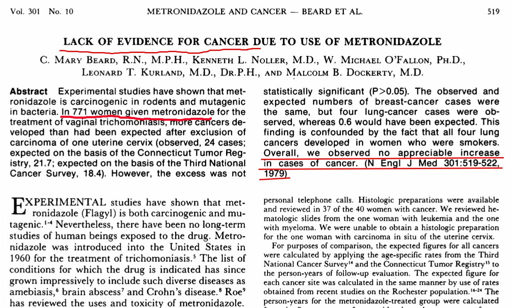

## Evidence found 

**Oral exposure of MNZ has shown carcinogenic activity in mice and rats.**

                      | Results   |Year      | Authors  |   
:--------------------:|----------:|---------:|:--------:|
_Carcinogenic cites:_ |           |          |          |
**Pulmonary**         |$\uparrow$ | 1972     |[Rustia and Shubik](http://www.ncbi.nlm.nih.gov/pubmed/5058971) |    
                      |$\uparrow$ | 1977     |[IARC](http://www.inchem.org/documents/iarc/vol13/metronidazole.html) | 
                      |$\uparrow$ | 1983     |[Cavaliere _et al._](http://www.ncbi.nlm.nih.gov/pubmed/?term=Cavaliere+1983%2C+metronidazole) |
**Liver**             |$\uparrow$ | 1979     |[Rustia and Shubik](http://www.ncbi.nlm.nih.gov/pubmed/288941)|
**Lymphomas**         |$\uparrow$ | 1972     |[Rustia and Shubik](http://www.ncbi.nlm.nih.gov/pubmed/5058971)|
**Mammary-gland**     |$\uparrow$ | 1979     |[Rustia and Shubik](http://www.ncbi.nlm.nih.gov/pubmed/288941)|
                      |$\uparrow$ | 1984     |[Cavaliere _et al._](http://www.ncbi.nlm.nih.gov/pubmed/?term=Cavaliere+1984%2C+metronidazole) |
**Pituitary-gland**   |$\uparrow$ | 1979     |[Rustia and Shubik](http://www.ncbi.nlm.nih.gov/pubmed/288941)|
_Genetic damage_      |$\bigotimes$| 2000    |[Touati _et al_](http://jac.oxfordjournals.org/content/46/6/987.long)
_Reproductive Organs   & Fertility_  |$\downarrow$| 2013    |[Kumari and Singh](http://www.ncbi.nlm.nih.gov/pmc/articles/PMC3914484/)|

--- .segue bg:black

# However, not in humans

--- 
[Lack of evidence for cancer due to use of metronidazole. N Engl J Med. 1979;301:519–522.](http://www.nejm.org/doi/full/10.1056/NEJM197909063011003)

--- 

## Other cancer studies in Humans

* Data on MNZ carcinogenecity for humans is still not sufficient. 

* No increased cancer risk in 12,000 users of MNZ.^1 $\Longrightarrow$ Only followed for 2.5 years. (A letter to JAMA)

* No association between short-term exposure to MNZ and cancer in human were found in 5,222 MNZ user/nonuser pairs **(RR 0.98; 95% CI, 0.80$-$1.20)**^2

* Another retrospective study^3 of children ($<$ 5 $y.$, _n_ $=$ 328,846) who had been exposed to MNZ in utero also reported **negative results (RR 0.81; 95% CI, 0.41$-$1.59)** on cancer incidence of all sites. 

  

1. [Danielson 1982](http://jama.jamanetwork.com/article.aspx?articleid=372448); 2.[Falagas _et al._ 1998](http://cid.oxfordjournals.org/content/26/2/384.short); 3. [Thapa _et al._ 1998](http://onlinelibrary.wiley.com/doi/10.1002/%28SICI%291097-0142%2819981001%2983:7%3C1461::AID-CNCR25%3E3.0.CO;2-1/abstract)

--- 

## Other potential (very rare) side effects 
1. Brain/nerve related: seizures^1 , aseptic meningitis^2 , encephalopathy^3 .  $\Longrightarrow$ Prolonged use of MNZ. 
2. Gastrointestinal tract related: nausea, occasionally vomiting, diarrhea.^4   $\Longrightarrow$ Daily dose $\geq$ 2250 mg.
3. Skin eruption^5 , pancreatitis^6 .

* **Drug-drug interaction:**
    + $\uparrow$ the effect of warfarin.
    + $\downarrow$ the function of ALDH2. 

  
1. [Hari _et al._ 2013](http://www.ncbi.nlm.nih.gov/pmc/articles/PMC3696306/); 2. [Farmakiotis _et al._ 2016](http://www.nejm.org/doi/full/10.1056/NEJMicm1505174); 3. [Khan _et al._, 2007](http://annals.org/article.aspx?articleid=659104&resultClick=3);4. [Ohnishi _et al._ 2014](http://www.sciencedirect.com/science/article/pii/S1383576914000725);5. [Kumar _et al._ 2013](http://www.ncbi.nlm.nih.gov/pmc/articles/PMC3830266/);6. [O’Halloran _et al._ 2010](http://www.ncbi.nlm.nih.gov/pmc/articles/PMC2939404/).

---
Recommended regimens in [UK](https://www.evidence.nhs.uk/formulary/bnfc/current/1-gastro-intestinal-system/13-antisecretory-drugs-and-mucosal-protectants/helicobacter-pylori-infection) 

   |            |  Age Range ($y.$) |Oral dose (mg per day)  with omeprazole (PPI)|   combined with    |
---|:----------:|:--------------:|:---------------------------------------:|-------------------:|
   |AMPC        |   $1\sim 6$     |      250, twice                      |                CLA |
   |            |                |     125, 3 times                     |                MNZ |         
   |            | $6\sim 12$      |     500, twice                       |                CLA | 
   |            |                |     250, 3 times                     |                MNZ |
   |            |$12\sim18$      |  1000, twice                          |                CLA |
   |            |                |      500, 3 times                     |                MNZ |
   |CLA         |  $1\sim12$     |       7.5 mg/kg (max. 500), twice     |      MNZ/AMPC  |
   |            |$12\sim18$      |     500, twice                       |           MNZ/AMPC  |
   |MNZ         |   $1\sim 6$      |      100, twice                      |                CLA |
   |            |                |     100, 3 times                     |                AMPC |         
   |            |  $6\sim 12$      |     200, twice                       |                CLA | 
   |            |                |     200, 3 times                     |                AMPC |
   |            |$12\sim18$     |     400, twice                       |                CLA |
   |            |                |    400, 3 times                     |                AMPC |
Abbreviations: AMPC, amoxicillin; CLA, clarithromycin; MNZ, metronidazole.

---
[Evidence-based guidelines from **ESPGHAN** and **NASPGHAN** for _Helicobacter pylori_ infection in children. J Pediatr Gastroenterol Nutr. 2011;53:230–243.](http://www.ncbi.nlm.nih.gov/pubmed/?term=21558964)

--- 

## Conclusion

* So far, there is **no convincing evidence** that short-term exposure to metronidazole would increase the risk of any cancer in human. 

* Considering the high resistance rate of clarithromycin in Japanese children, first-line therapy of PPI + amoxicillin + metronidazole is recommended. 

